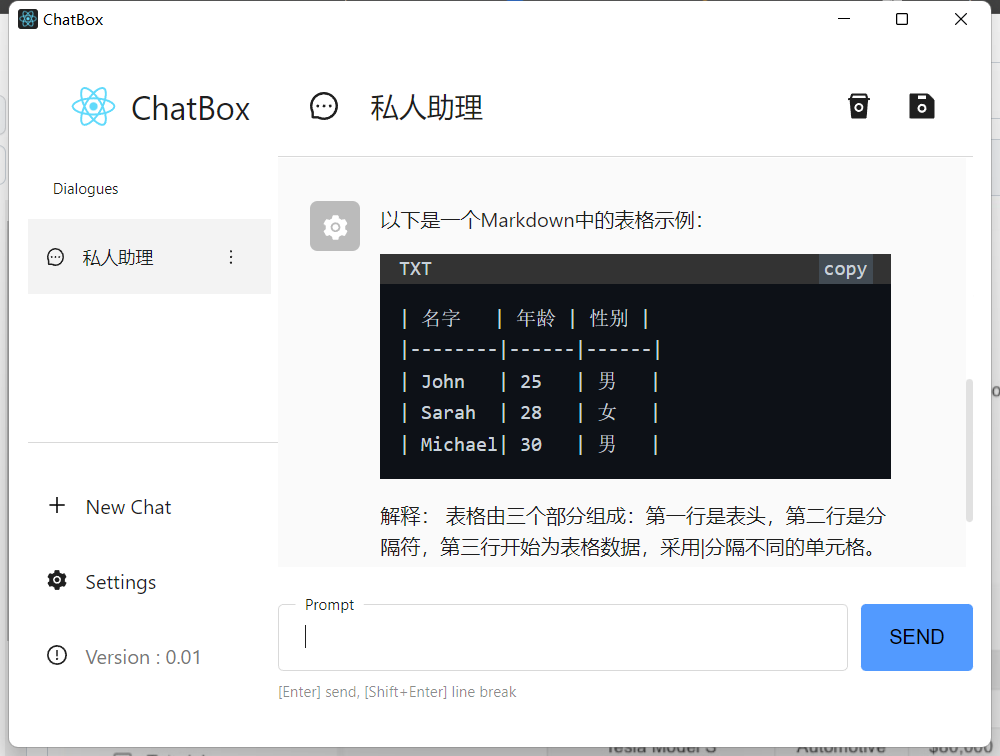
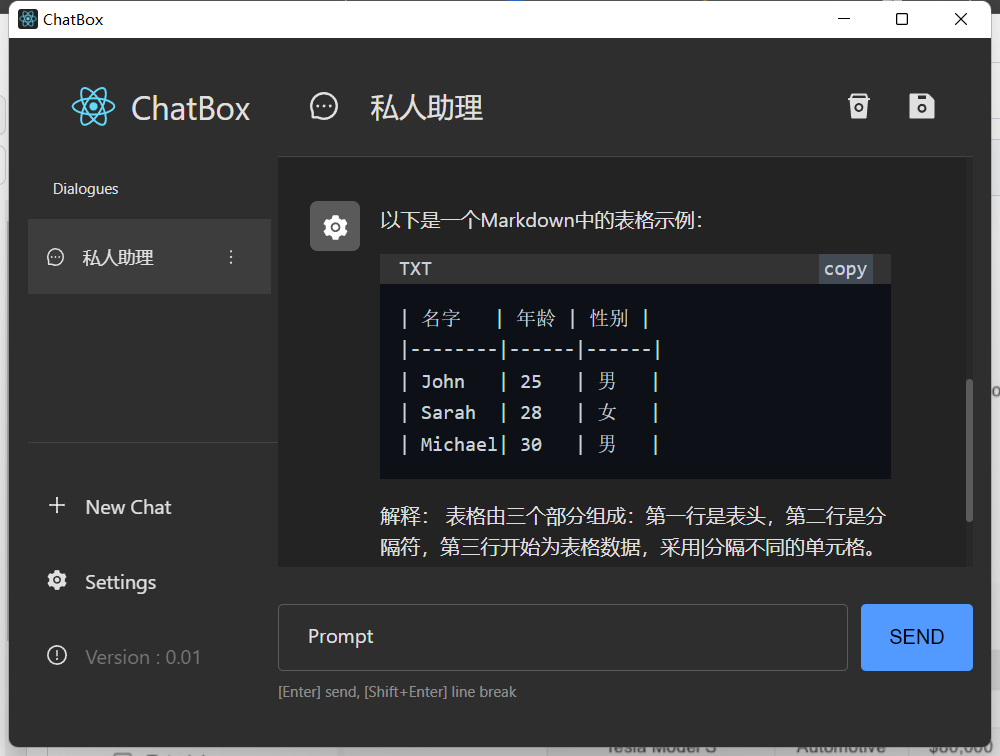

#### ChatBox

<!-- Badge -->

[](https://github.com/nakeking 'Nakeking')

<!-- 
 -->

#### 特性

- AI 聊天与会话管理
- 数据存储在本地，不会丢失
- 内置开箱即用的 AI 服务
- 支持 OpenAI(GPT3.5)
- Markdown 和代码高亮
- 流式回复，打字机特效
- 符合人体工程学的 UI 设计，夜间模式
- 国际化(en/zh)
- 免费，开源

#### 环境搭建

##### pnpm，create-react-app 创建 react 项目

```
pnpx create-react-app electron-chatbox --use-pnpm --template typescript

// cd electron-chatbox
// 删除 node_modules 文件夹

pnpm install

// 你可能会遇到一个错误
// Property 'toBeInTheDocument' does not exist on type 'JestMatchers<HTMLElement>'.

pnpm add -D @types/testing-library__jest-dom

// https://dev.to/lico/set-up-create-react-app-using-pnpm-nji
```

##### 安装 Electron

```
pnpm add -D electron

// 你可能会遇到一个错误
Error: Electron failed to instal1 correctly, please delete node modules/electron and try installing again

// 方法一
// 进入 node_modules/electron
npm install
// cnpm install

// 方法二
pnpm config set electron_mirror "https://npm.taobao.org/mirrors/electron/"

pnpm add -D electron

// 后续步骤请参考electron官方文档
https://www.electronjs.org/zh/docs/latest/tutorial/quick-start

```

##### 添加 Electron 调试

```
pnpm add -D electron-devtools-installer electron-debug devtron
pnpm add -S electron-is-dev

// main.ts
const isDev = require('electron-is-dev');
// const { default: installExtension, REDUX_DEVTOOLS } = require('electron-devtools-installer');
const { default: installExtension, REACT_DEVELOPER_TOOLS } = require("electron-extension-installer")


// 利用electron-debug，添加和Chrome类似的快捷键
isDev && require('electron-debug')({ enabled: true, showDevTools: false });

// 添加Chromium插件
function createDevTools() {
  installExtension(REACT_DEVELOPER_TOOLS, {
    loadExtensionOptions: {
      allowFileAccess: true,
    }
  })
  .then((name) => console.log(`Added Extension:  ${name}`))
  .catch((err) => console.log('An error occurred: ', err));
}

app.whenReady().then(() => {
  ...

  // 开发环境加载开发者工具
  + isDev && createDevTools()

  ...
})

// 请根据自身项目Electron版本选择使用工具加载 DevTools 扩展
// electron-devtools-installer 和 electron-extension-installer
// 当前项目Electron版本25.1.0，使用electron-extension-installer进行安装 React_Developer_Tools拓展。
// 当使用 electron-devtools-installer 安装 React_Developer_Tools时报错，尝试安装其他扩展(REDUX_DEVTOOLS)正常。似乎是与 Electron >= 24.0版本问题。
// https://github.com/MarshallOfSound/electron-devtools-installer/issues/238

```

#### 启动项目

```
// 启动方式一
// package.json
"script": {
  "start": "concurrently \"npm run start:react\" \"npm run start:electron\"",
  "start:react": "cross-env BROWSER=none craco start",
  "start:electron": "wait-on http://localhost:3000 && electron app",
}

// concurrently: 同时执行两条(或多条)命令
// cross-env BROWSER=none: 设置默认不打开浏览器。cross-env做传参兼容
// wait-on: 因为两条命令是同时运行，设置wait-on等待http服务准备就绪，再启动Electron
// https://juejin.cn/post/6844903669293400072
```

```
// 启动方式二
// package.json
"script": {
  "start": "concurrently \"npm run start:react\"",
  "start:react": "cross-env BROWSER=none craco start"
}

// .vscode/lauch.json
{
  "version": "0.2.0",
  "configurations": [
    {
      "name": "Debug Main Process",
      "type": "node",
      "request": "launch",
      "cwd": "${workspaceFolder}",
      "runtimeExecutable": "${workspaceFolder}/node_modules/.bin/electron",
      "windows": {
        "runtimeExecutable": "${workspaceFolder}/node_modules/.bin/electron.cmd"
      },
      "args": ["."]
    }
  ]
}

// npm run start 启动http服务
// 再使用 vscode 开启调试项目
```

#### 你可能会遇到的问题集合

```
react-scripts 5 webpack Module not found: Error: Can't resolve 'fs'|'crypto'| ...

// https://github.com/facebook/create-react-app/issues/11756
```

```
fs.existsSync is not a function

// craco.config.js
module.exports = {
  webpack: {
      configure: {
        + target: 'electron-main',
        ...
      }
  }
  ...
}

// 目前使用的是craco配置webpack，使用react-app-rewired可移步文档添加此项配置
```

```
Uncaught ReferenceError: require is not defined

// main.ts
new BrowserWindow({
  ...
  webPreferences: {
    + nodeIntegration: true,
    + contextIsolation: false,
    ...
  }
  ...
})
```
